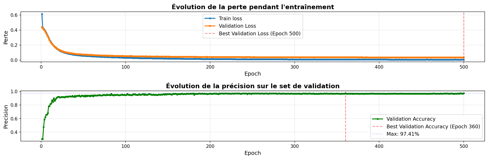
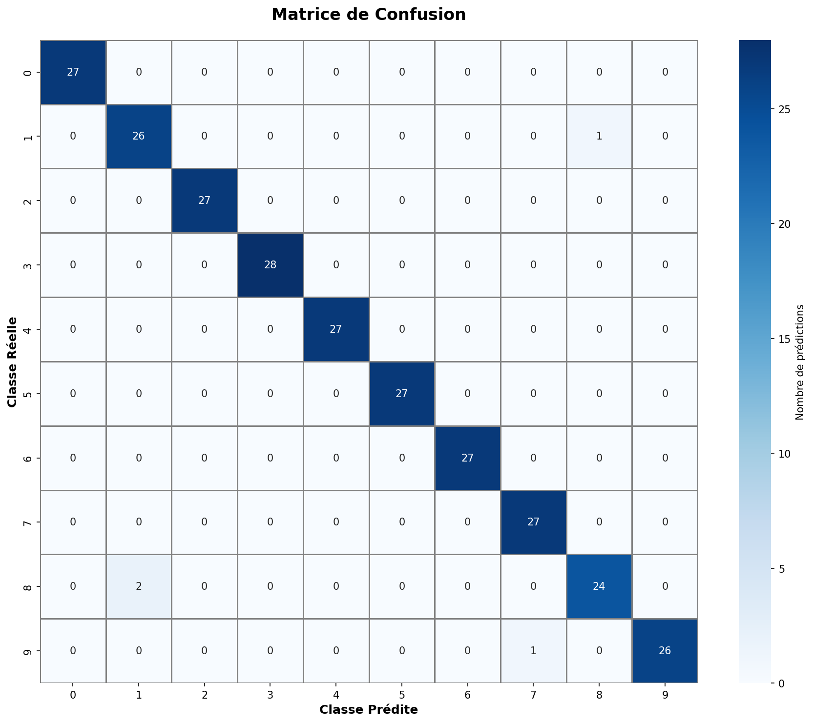
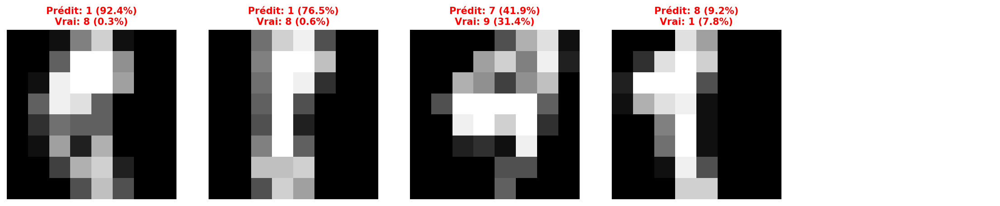

# Digit Recognition From Scratch

A fully connected neural network for handwritten digit classification, implemented **from scratch in pure NumPy** - no PyTorch, TensorFlow, or autograd. Every component (dense layers, forward/backward propagation, gradient descent, loss functions) is hand-derived and hand-coded to demonstrate a solid understanding of the mathematics behind deep learning.

Trained on the [`scikit-learn` `load_digits`](https://scikit-learn.org/stable/modules/generated/sklearn.datasets.load_digits.html) dataset (1,797 8x8 grayscale images of digits 0-9), the model reaches **98.5% test accuracy**.

## Why this project

Frameworks like PyTorch or TensorFlow abstract away the backpropagation math. This project intentionally avoids them to prove the underlying concepts are fully understood: matrix-based forward propagation, the chain rule applied layer by layer during backpropagation, gradient computation, and parameter updates via mini-batch gradient descent - all implemented manually with NumPy.

## Results

| Metric | Score |
|---|---|
| Train accuracy | 99.20% |
| Validation accuracy | 97.41% |
| **Test accuracy** | **98.52%** |
| Final train loss | 0.0059 |
| Final validation loss | 0.0342 |



## Error analysis

Global accuracy hides more than it reveals. The evaluation suite breaks the model's behaviour down class by class and example by example.



On the 270 test images the model makes **4 errors**, and they are not randomly distributed - three of them are the same confusion:

| True | Predicted | Confidence in prediction | Confidence in true class |
|---|---|---|---|
| 8 | 1 | 92.4% | 0.3% |
| 8 | 1 | 76.5% | 0.6% |
| 1 | 8 | 9.2% | 7.8% |
| 9 | 7 | 41.9% | 31.4% |

The **1 ↔ 8 pair accounts for 75% of all errors**. At 8x8 resolution a narrow `8` and a `1` drawn with a base serif collapse into nearly identical pixel patterns: the information needed to separate them is largely destroyed by the downsampling rather than missed by the network. This points to a data-resolution limit rather than an optimization failure - the remaining headroom lies in higher-resolution inputs or convolutional features, not in longer training.



### Confidence is a usable signal

The output probabilities correlate well with correctness, which means the model knows when it is unsure:

| | Mean confidence |
|---|---|
| Correct predictions | 95.19% |
| Incorrect predictions | 55.00% |

A 40-point gap. Exploiting it by abstaining on low-confidence inputs yields a tunable accuracy/coverage trade-off:

| Confidence threshold | Coverage | Accuracy on retained predictions |
|---|---|---|
| ≥ 50% | 96.3% | 99.23% |
| ≥ 70% | 95.2% | 99.22% |
| ≥ 90% | 89.3% | 99.59% |

Rejecting the 10.7% least confident inputs raises accuracy from 98.52% to **99.59%** - the deferral strategy a production classifier would use to route ambiguous cases to a human reviewer. Only one error slips through with high confidence (92.4%), and it is one of the `8 → 1` cases.

## Architecture

- **Network**: fully connected feedforward network, architecture `[64, 128, 64, 10]`
- **Input**: 64 features (8x8 pixel images, normalized to `[0, 1]`)
- **Hidden layers**: ReLU activation
- **Output layer**: Sigmoid activation, 10 units (one-hot digit classes)
- **Loss**: Mean Squared Error
- **Optimizer**: Mini-batch gradient descent
- **Weight initialization**: Xavier/Glorot uniform initialization

### Hyperparameters

| Parameter | Value |
|---|---|
| Learning rate | 0.05 |
| Epochs | 500 |
| Batch size | 32 |
| Random seed | 42 |

## Project structure

```
Digit-Recognition-From-Scratch/
├── main.py                     # Training entry point
├── src/
│   ├── data/
│   │   └── data_loader.py      # Dataset loading, normalization, train/val/test split
│   ├── models/
│   │   ├── layer.py            # Dense layer: forward/backward pass, parameter updates
│   │   ├── neural_network.py   # Network: forward/backward propagation, training loop
│   │   └── evaluate.py         # Confusion matrix, per-class metrics, error analysis
│   └── utils/
│       └── math_functions.py   # Activation functions and their derivatives
├── models/                     # Saved model weights (.npz)
├── results/                    # Training curves and history
└── requirements.txt
```

## Implementation highlights

- **Forward propagation**: matrix multiplication through each layer (`Z = X @ W + b`), ReLU on hidden layers, Sigmoid on the output layer.
- **Backpropagation**: gradients derived manually and propagated backward through every layer using the chain rule, including derivatives of the loss, the sigmoid, and ReLU.
- **Mini-batch gradient descent**: data is shuffled every epoch and split into batches to update weights incrementally.
- **Evaluation suite** (`src/models/evaluate.py`): confusion matrix, per-class precision/recall/F1, confidence distribution analysis, and visualization of the worst predictions.

## Getting started

### Prerequisites

- Python 3.10+

### Installation

```bash
git clone https://github.com/<your-username>/Digit-Recognition-From-Scratch.git
cd Digit-Recognition-From-Scratch
python -m venv env
source env/bin/activate  # On Windows: env\Scripts\activate
pip install -r requirements.txt
```

### Train the model

```bash
python main.py
```

This will load the dataset, train the network for 500 epochs, print training metrics, and save:
- Model weights → `models/model_weights_<timestamp>.npz`
- Training curves → `results/training_history_<timestamp>.png`
- Training history data → `results/training_history_<timestamp>.npz`

### Evaluate a trained model

```bash
python -m src.models.evaluate
```

Generates a confusion matrix, per-class performance report, confidence distribution, and visualizes the worst predictions on the test set.

## Possible improvements

- Replace MSE with cross-entropy loss for a probabilistic output layer (softmax)
- Add L2 regularization / dropout to further reduce the train/validation gap
- Implement momentum or Adam optimization
- Extend to the full MNIST dataset (28x28 images)

## License

This project is open source and available under the MIT License.

---

# Reconnaissance de Chiffres From Scratch

Un réseau de neurones entièrement connecté pour la classification de chiffres manuscrits, implémenté **entièrement en NumPy pur** - sans PyTorch, TensorFlow ou autograd. Chaque composant (couches denses, propagation avant/arrière, descente de gradient, fonctions de perte) est dérivé mathématiquement et codé à la main pour démontrer une compréhension solide des mathématiques du deep learning.

Entraîné sur le jeu de données [`load_digits` de `scikit-learn`](https://scikit-learn.org/stable/modules/generated/sklearn.datasets.load_digits.html) (1 797 images 8x8 en niveaux de gris représentant les chiffres 0 à 9), le modèle atteint **98,5 % de précision sur le set de test**.

## Pourquoi ce projet

Les frameworks comme PyTorch ou TensorFlow masquent les mathématiques de la rétropropagation. Ce projet les évite volontairement afin de prouver une maîtrise complète des concepts sous-jacents : propagation avant sous forme matricielle, application de la règle de dérivation en chaîne couche par couche lors de la rétropropagation, calcul des gradients, et mise à jour des paramètres via une descente de gradient par mini-lots - le tout implémenté manuellement avec NumPy.

## Résultats

| Métrique | Score |
|---|---|
| Précision entraînement | 99,20 % |
| Précision validation | 97,41 % |
| **Précision test** | **98,52 %** |
| Perte finale (entraînement) | 0,0059 |
| Perte finale (validation) | 0,0342 |


## Analyse des erreurs

La précision globale cache plus qu'elle ne révèle. La suite d'évaluation décompose le comportement du modèle classe par classe et exemple par exemple.


Sur les 270 images de test, le modèle commet **4 erreurs**, et elles ne sont pas distribuées au hasard - trois d'entre elles sont la même confusion :

| Vrai | Prédit | Confiance dans la prédiction | Confiance dans la vraie classe |
|---|---|---|---|
| 8 | 1 | 92,4 % | 0,3 % |
| 8 | 1 | 76,5 % | 0,6 % |
| 1 | 8 | 9,2 % | 7,8 % |
| 9 | 7 | 41,9 % | 31,4 % |

La **paire 1 ↔ 8 représente 75 % des erreurs**. En résolution 8x8, un `8` étroit et un `1` tracé avec un empattement à la base se réduisent à des motifs de pixels quasi identiques : l'information nécessaire pour les distinguer est largement détruite par le sous-échantillonnage plutôt que manquée par le réseau. Cela traduit une limite de résolution des données et non un échec d'optimisation - la marge de progression restante se situe dans des entrées de plus haute résolution ou des features convolutives, pas dans un entraînement plus long.


### La confiance est un signal exploitable

Les probabilités de sortie sont bien corrélées à la justesse des prédictions, ce qui signifie que le modèle « sait » quand il est incertain :

| | Confiance moyenne |
|---|---|
| Prédictions correctes | 95,19 % |
| Prédictions incorrectes | 55,00 % |

Un écart de 40 points. L'exploiter en s'abstenant sur les entrées peu fiables donne un compromis précision/couverture réglable :

| Seuil de confiance | Couverture | Précision sur les prédictions retenues |
|---|---|---|
| ≥ 50 % | 96,3 % | 99,23 % |
| ≥ 70 % | 95,2 % | 99,22 % |
| ≥ 90 % | 89,3 % | 99,59 % |

Rejeter les 10,7 % d'entrées les moins fiables fait passer la précision de 98,52 % à **99,59 %** - la stratégie de délégation qu'un classifieur en production utiliserait pour router les cas ambigus vers une relecture humaine. Une seule erreur passe au travers avec une confiance élevée (92,4 %), et il s'agit d'un des cas `8 → 1`.

## Architecture

- **Réseau** : réseau feedforward entièrement connecté, architecture `[64, 128, 64, 10]`
- **Entrée** : 64 features (images 8x8 pixels, normalisées entre `[0, 1]`)
- **Couches cachées** : activation ReLU
- **Couche de sortie** : activation Sigmoïde, 10 unités (classes one-hot)
- **Fonction de perte** : Erreur Quadratique Moyenne (MSE)
- **Optimiseur** : descente de gradient par mini-lots
- **Initialisation des poids** : initialisation uniforme de Xavier/Glorot

### Hyperparamètres

| Paramètre | Valeur |
|---|---|
| Taux d'apprentissage | 0,05 |
| Epochs | 500 |
| Taille de batch | 32 |
| Graine aléatoire | 42 |

## Structure du projet

```
Digit-Recognition-From-Scratch/
├── main.py                     # Point d'entrée de l'entraînement
├── src/
│   ├── data/
│   │   └── data_loader.py      # Chargement, normalisation, split train/val/test
│   ├── models/
│   │   ├── layer.py            # Couche dense : forward/backward, mise à jour des paramètres
│   │   ├── neural_network.py   # Réseau : propagation avant/arrière, boucle d'entraînement
│   │   └── evaluate.py         # Matrice de confusion, métriques par classe, analyse d'erreurs
│   └── utils/
│       └── math_functions.py   # Fonctions d'activation et leurs dérivées
├── models/                     # Poids des modèles sauvegardés (.npz)
├── results/                    # Courbes et historiques d'entraînement
└── requirements.txt
```

## Points clés de l'implémentation

- **Propagation avant** : multiplication matricielle à travers chaque couche (`Z = X @ W + b`), ReLU sur les couches cachées, Sigmoïde sur la couche de sortie.
- **Rétropropagation** : gradients dérivés manuellement et propagés en arrière à travers chaque couche via la règle de la chaîne, incluant les dérivées de la perte, de la sigmoïde et de ReLU.
- **Descente de gradient par mini-lots** : les données sont mélangées à chaque epoch et divisées en batches pour une mise à jour incrémentale des poids.
- **Suite d'évaluation** (`src/models/evaluate.py`) : matrice de confusion, précision/rappel/F1 par classe, analyse de la distribution des confiances, et visualisation des pires prédictions.

## Démarrage

### Prérequis

- Python 3.10+

### Installation

```bash
git clone https://github.com/<votre-nom-utilisateur>/Digit-Recognition-From-Scratch.git
cd Digit-Recognition-From-Scratch
python -m venv env
source env/bin/activate  # Sous Windows : env\Scripts\activate
pip install -r requirements.txt
```

### Entraîner le modèle

```bash
python main.py
```

Ceci charge le dataset, entraîne le réseau pendant 500 epochs, affiche les métriques d'entraînement, et sauvegarde :
- Les poids du modèle → `models/model_weights_<timestamp>.npz`
- Les courbes d'entraînement → `results/training_history_<timestamp>.png`
- L'historique d'entraînement → `results/training_history_<timestamp>.npz`

### Évaluer un modèle entraîné

```bash
python -m src.models.evaluate
```

Génère une matrice de confusion, un rapport de performance par classe, l'analyse de la distribution des confiances, et visualise les pires prédictions sur le set de test.

## Améliorations possibles

- Remplacer la MSE par une cross-entropie pour une couche de sortie probabiliste (softmax)
- Ajouter de la régularisation L2 / du dropout pour réduire davantage l'écart train/validation
- Implémenter une optimisation avec momentum ou Adam
- Étendre le projet au dataset MNIST complet (images 28x28)

## Licence

Ce projet est open source et disponible sous licence MIT.
